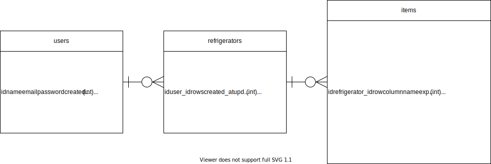

# 冷蔵庫管理ツール

> 冷蔵庫を開けなくてもどこに何が入っているのかがわかるようにするツールです。

## 環境
- Laravel 7.25.0
- Vue.js 2.6.11
- MySQL 8.0.21

## 機能
- ユーザー登録
- ログイン
- 冷蔵庫登録
- 冷蔵庫一覧表示
- 冷蔵庫編集
- 冷蔵庫削除
- アイテム登録
- 写真アップロード
- アイテム一覧表示
- アイテム個別表示
- アイテム編集
- アイテム削除

## テーブル（ER図）

  

## URL一覧
### API
|URL|メソッド|内容|備考|
|:--|:-:|:--|:--|
|/api/register|POST|ユーザー登録||
|/api/login|POST|ログイン||
|/api/logout|POST|ログアウト|要認証|
|/api/user|GET|認証ユーザー取得||
|/api/refrigerators|GET|冷蔵庫一覧|要認証|
|/api/refrigerators|POST|冷蔵庫情報登録|要認証|
|/api/refrigerators/{refrigerator_id}|PUT|冷蔵庫情報編集|要認証|
|/api/refrigerators/{refrigerator_id}|DELETE|冷蔵庫削除|要認証|
|/api/refrigerators/{refrigerator_id}|GET|冷蔵庫内アイテム一覧|要認証|
|/api/refrigerators/{refrigerator_id}/item|POST|冷蔵庫内アイテム情報登録|要認証|
|/api/refrigerators/{refrigerator_id}/{item_id}|PUT|冷蔵庫内アイテム情報編集|要認証|
|/api/refrigerators/{refrigerator_id}/{item_id}|DELETE|冷蔵庫内アイテム削除|要認証|

### フロントエンド
|URL|内容|備考|
|:--|:--|:--|
|/|トップページ||
|/login|ログイン、会員登録ページ||
|/refrigerators|冷蔵庫選択ページ||
|/refrigerators/{refrigerator_id}|冷蔵庫内確認ページ||